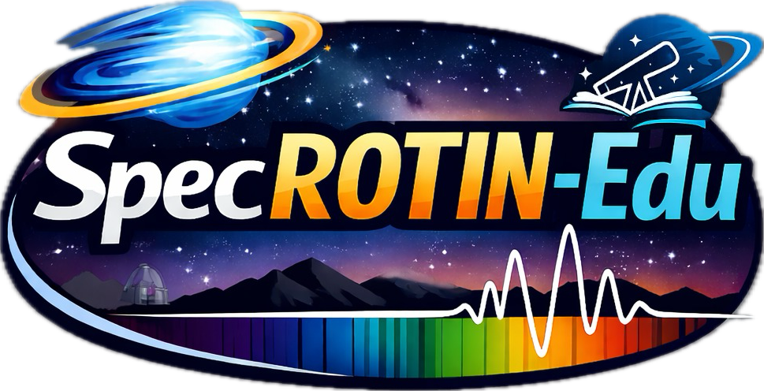
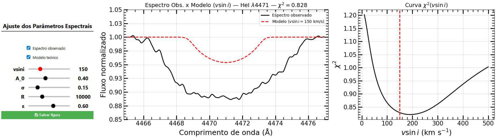

# specROTIN-edu
SpecROTIN-Edu is an interactive educational tool in Python for teaching the effects of stellar rotation on spectral profiles. Inspired by the IRAF's ROTIN routine, it allows for the estimation of visini, visualizing in real time the effects of rotational and instrumental broadening on the stellar spectrum, making it ideal for educational activities in Astronomy.

  

# Spectral line fitting and vsini determination

This repository contains a Python code to fit stellar spectral lines and
estimate the projected rotational velocity (v sin i) by comparing an
observed spectrum with a theoretical model including rotational and
instrumental broadening.

## Requirements

- Python ≥ 3.8
- numpy
- scipy
- matplotlib
- astropy
- ipywidgets (optional, for interactive mode)

## Input data  (from BeSS database)

- The observed spectrum must be provided as a **1D FITS file**.
- The FITS file must be in the **same directory** as the script.
- The FITS header must contain:
  - `CRVAL1` – starting wavelength (Å)
  - `CDELT1` – wavelength step (Å/pixel)
  - `NAXIS1` – number of pixels
- The spectral flux must be stored in `hdul[0].data`.

The spectrum is assumed to be:
- wavelength calibrated,
- free of major artifacts,
- suitable for local continuum normalization.

## Workflow

1. Read the FITS file and extract the flux and header information.
2. Reconstruct the wavelength axis using FITS keywords.
3. Select a wavelength region around the spectral line of interest.
4. Fit a local linear continuum using the edges of the selected region.
5. Normalize the observed spectrum by the fitted continuum.
6. Generate an intrinsic Gaussian absorption line model.
7. Apply rotational broadening using a limb-darkened rotation profile.
8. Convolve the model with the instrumental profile defined by the spectral resolution `R`.
9. Interpolate the model onto the observed wavelength grid.
10. Compute χ² between the observed and modeled spectra.
11. Scan a grid of `v sin i` values and determine the best-fit solution by minimizing χ².

## User instructions

To apply the method, the user should:

1. Place the FITS spectrum in the same directory as the analysis code.
2. Set the central wavelength of the spectral line of interest in the script.
3. Define the pixel range corresponding to the selected spectral region.
4. Run the code to perform continuum normalization and model fitting.
5. Inspect the resulting spectral fit and the χ²(`v sin i`) curve to identify the optimal solution.

## Output

- Comparison plot of the observed normalized spectrum and the best-fit model.
- χ²(`v sin i`) curve used to identify the optimal rotational velocity.
- Optional figure saving from the interactive interface.

  

## Notes

- The code uses a simple χ² definition without observational uncertainties.
- The intrinsic line profile is modeled as a Gaussian absorption line.
- The workflow can be adapted to other spectral lines by changing the central wavelength.
